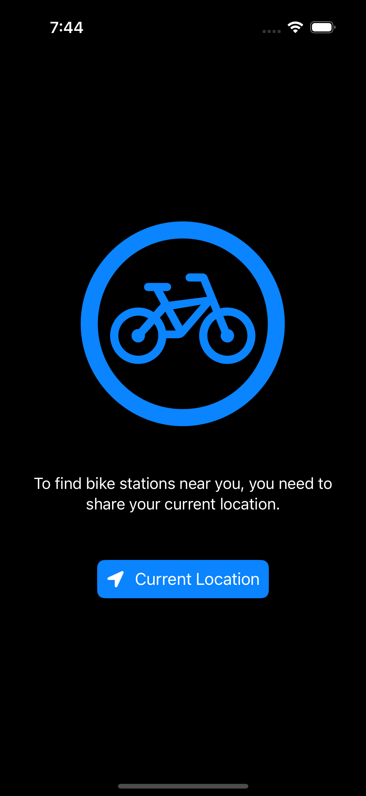
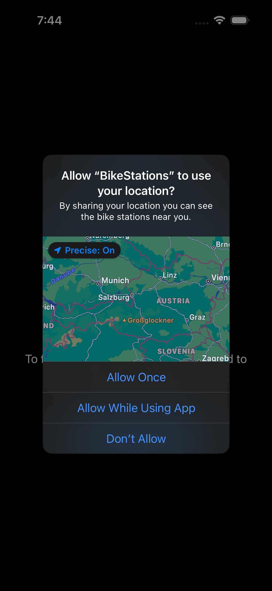
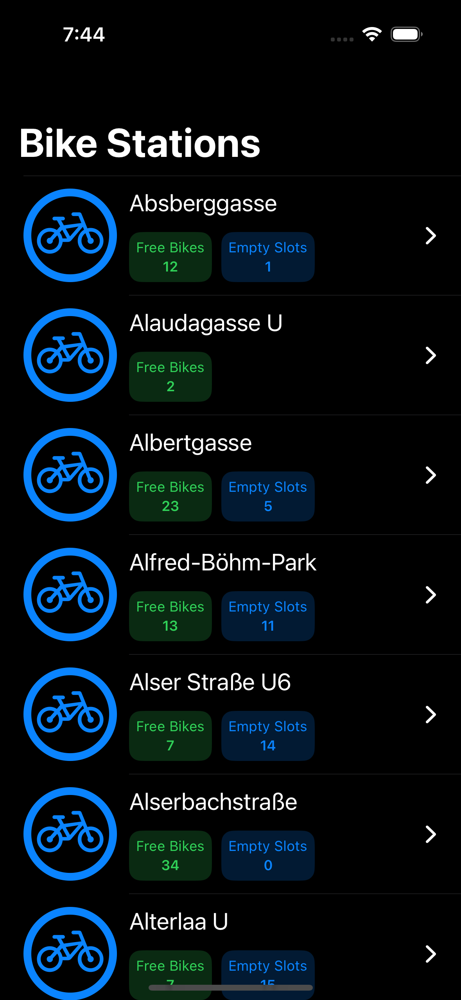
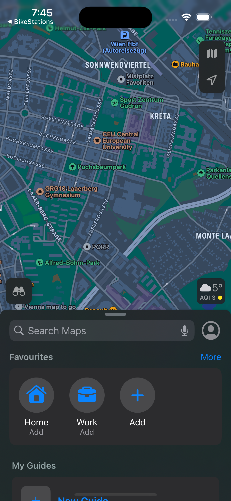

# BikeStations_App

## Table of contents
* [Video Link](#video-link)
* [Screenshots](#screenshots)
* [Description](#description)
* [Requirements](#Requirements)
* [Architecture](#Architecture)
* [Contact](#contact)

## Video Link

[Bike Stations App Video]()

## Screenshots

 User Location Screen      |  User Location Permission Screen
:-------------------------:|:-------------------------:
  |  

 Bike Station List Screen  |  Bike Station in Map Screen
:-------------------------:|:-------------------------:
 |  

## Description

The BikeStations iOS App is a SwiftUI-based application that provides a seamless experience for locating and viewing bike stations. 
It requests location permissions to determine the user's current position and accesses real-time data from the CityBik API. 
The app utilizes CoreLocation to sort bike stations dynamically by proximity or alphabetically when the location is unavailable. 
Bike station details, such as name, available bikes, and empty slots, are displayed in a interactive list. 
The app leverages CoreData for efficient offline storage of station data and async/await for smooth asynchronous network operations. 
Selecting a station from the list redirects users to its location on Maps for easy navigation. 
Built with Clean Architecture and MVVM, the app ensures scalability, maintainability, and testability. 
Its robust modular design combines performance and functionality, delivering a polished, efficient solution.

## Requirements

- The app requests location permissions on launch once and acquires the current location of the user.
- The app accesses `https://api.citybik.es/v2/networks/wienmobil-rad` and downloads a list of city bike bike stations.
- The app shows the bike stations in a list - the list is sorted by name as long as no current location has been acquired, or sorted by distance to current location if the current location has been acquired, closest first.
- Each list item shows the station name, number of bikes available and number of empty slots available.
- Tapping an item in the list opens the bike station on the Maps.

## Architecture

### Clean Architecture with MVVM using SwiftUI

- The app is built using Clean Architecture combined with the MVVM. This combination ensures that the app can be scalable, maintainable and testable.

- #### Core
	- The `Core` module encapsulates shared functionality used throughout the app. 
	- It includes:
		- `data`: (Contains `api` for the network layer and `coreData` for data storage.)
		- `domain`: (Contains the app core `models`.)
		- `utils`: (Provides utility objects that have a specific functionality.)
		- `extensions`: (Includes extensions for various built-in types to enhance functionality.)
		- `views`: (Hosts reusable UI components that are used across different features in the app.)
		
			
- #### Bike Stations List
	- The Bike Stations feature allows users to view a list of bike station near their location:
		- `services`: (Handles communication with the networking layer using dependency-injection to fetch data from the API and also creates an interface to store the api data using CoreData.)
		- `viewModels`: (Makes use of the service data using dependency-injection and transforms data and saves them in CoreData for display, handles states and error, and manages view logic.)
		- `views`: (Defines UI elements for displaying the bike stations list to the user and when a station is selected it's location will be displayed in the Maps.)

## Contact

Kevin Topollaj, email: kevintopollaj@gmail.com - feel free to contact me for any questions or suggestions!
